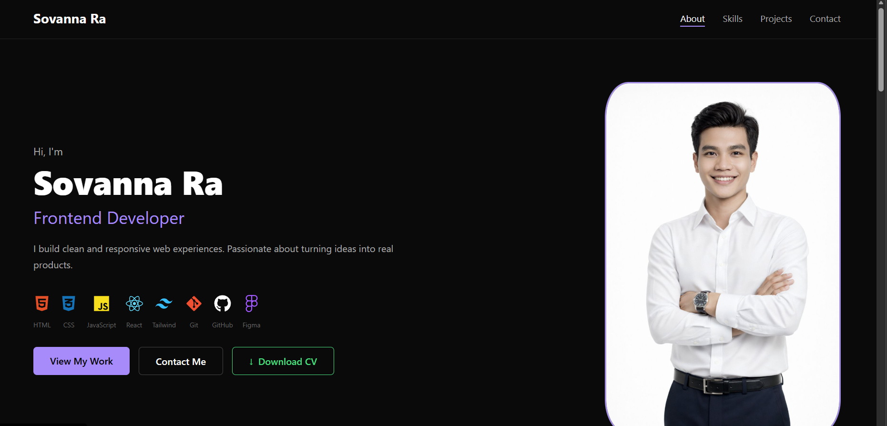

# Sovanna | Frontend Developer Portfolio

A personal portfolio website built with React. Clean, responsive, and modern design.

🌐 **Live Demo:** [sovanna-dev.github.io/my-portfolio](https://sovanna-dev.github.io/my-portfolio)

---

## Screenshot



---

## Built With

- React
- Framer Motion
- EmailJS
- React Icons
- GitHub Pages

---

## Features

- Smooth scroll animations
- Active nav link tracking
- Working contact form via EmailJS
- CV download button
- Fully responsive on all screen sizes
- SEO optimized

---

## Run Locally

Clone the project
```bash
git clone https://github.com/sovanna-dev/my-portfolio.git
```

Go into the project folder
```bash
cd my-portfolio
```

Install dependencies
```bash
npm install
```

Start the dev server
```bash
npm start
```

---

## Environment Variables

Create a `.env` file in the root folder and add:
```
REACT_APP_EMAILJS_SERVICE_ID=your_service_id
REACT_APP_EMAILJS_TEMPLATE_ID=your_template_id
REACT_APP_EMAILJS_PUBLIC_KEY=your_public_key
```

---

## Contact

Sovanna — [LinkedIn](https://linkedin.com/in/sovanna-ra-866504347/) — rasovanna785@email.com